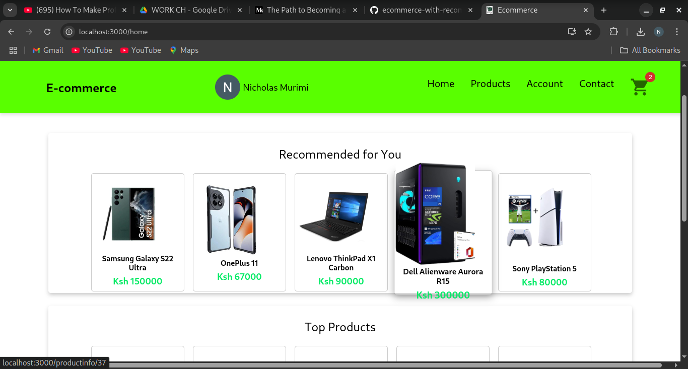
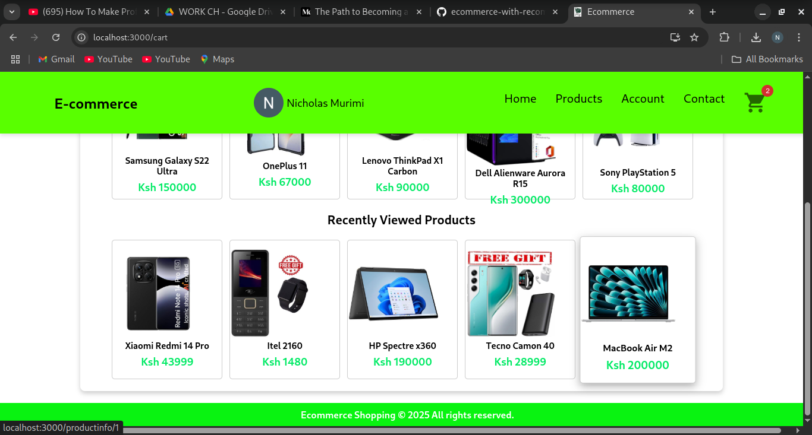
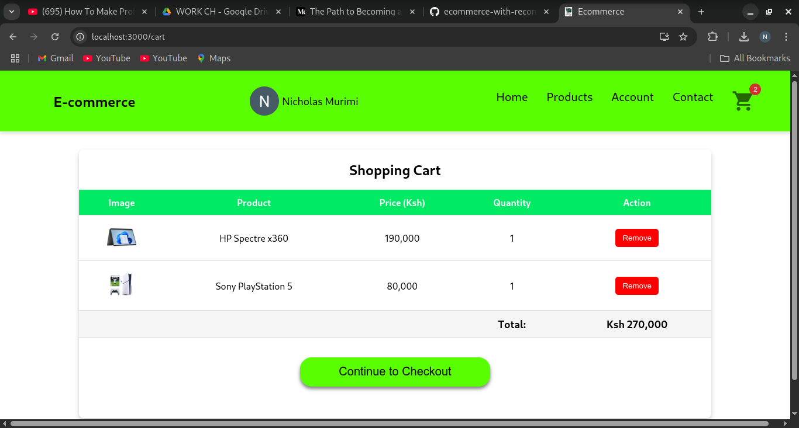
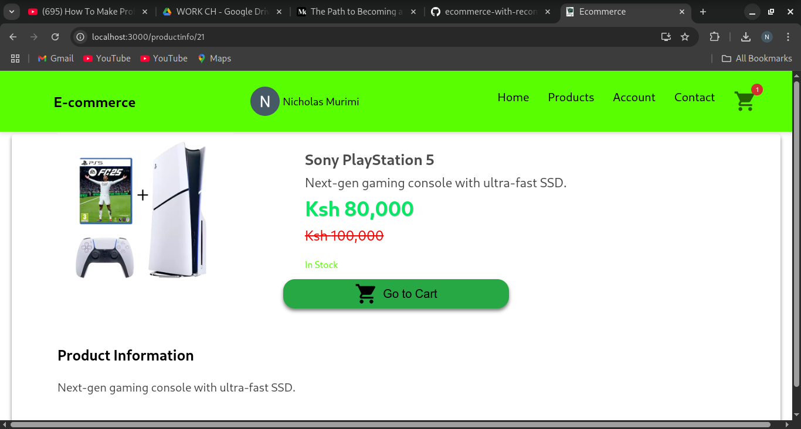
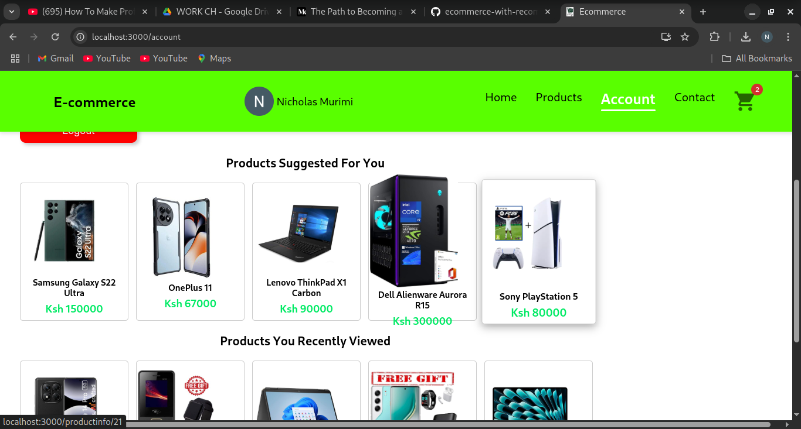
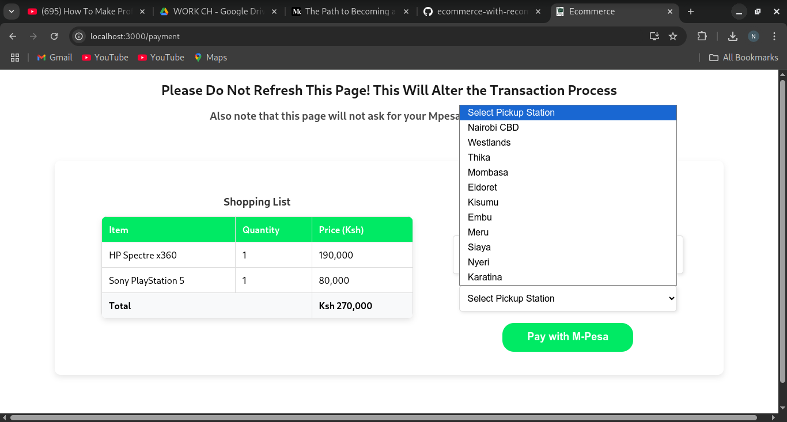

# 🛒 Ecommerce Website with Recommender System

A modern, user-friendly ecommerce web application built with **React**, featuring a personalized **product recommender system** to enhance the shopping experience. This project is aimed at demonstrating both frontend design skills and the logic behind product recommendations.

## 🌟 Features

- 🛍️ Browse and search for products
- 🧠 Smart Recommendations – Get personalized product suggestions based on behavior and preferences.
- 🔍 Advanced Filtering – Filter products by category for a streamlined shopping experience.
- 🧾 Cart Management – Add, view, and remove items from your cart effortlessly.
- 💳 Lipa na M-Pesa Integration – Seamless mobile payments powered by the Daraja API.
- 🌐 Responsive Design – Optimized for desktop, tablet, and mobile devices.
- ⚡ Smooth Performance – Fast loading and interactive UI for a better user experience.

## 🧠 How the Recommender System Works

> _"People buy what they see"_ — and this project ensures the right products are seen.

The recommender system is designed to enhance user engagement by showing:
- Popular products
- Recently viewed items
- Category-based suggestions (content-based filtering)

> Future updates will include collaborative filtering using user purchase history.

## 🚀 Live Demo

🔗 [Live Demo](https://your-deployment-link.com)  
📸 [Screenshots](#screenshots)

## 📸 Screenshots

|<p align="center">
  
  
  
</p>

<p align="center">
  
  
  
</p>


## 🛠️ Technologies Used

- **Frontend:** React, JavaScript, CSS
- **Routing:** React Router
- **State Management:** React useState / useEffect
- **Icons:** React Icons
- **Backend :** Flask, Daraja API
- **Recommendation Engine:** Currently client-side; backend model coming soon

## 🧑‍💻 Getting Started

### 1. Clone the Repository

```bash
git clone https://github.com/Nic3holas-wq/ecommerce-with-recommender-system.git
cd ecommerce-with-recommender-system
```

### 2. Install Fronted Dependencies
Make sure you have Node.js and npm installed.

```bash
cd client
npm install
```
### 3. Start the Fronted Development server
Make sure you have Node.js and npm installed.

```bash
npm start
```
This will run the frontend on http://localhost:3000.

### 4. Setup the Backend(Flask)
Make sure you have Python 3 and pip installed.

```bash
cd ../backend
pip install -r requirements.txt
```

### 5. Run the Flask Backend
```bash
python app.py
```
This will start the backend API (usually at http://localhost:5000).
